# ClaudeIsland

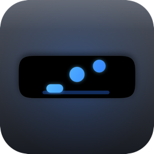

A Dynamic Island-style HUD pinned to the notch that shows, in real time, what
your running Claude Code sessions are doing.

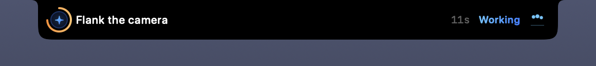

It rests as one line and says which session it is and what that session is doing.
Every state owns its own word, colour and mark:

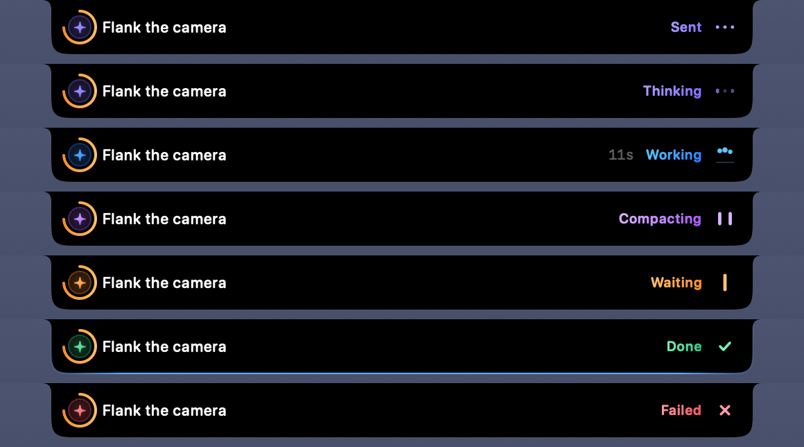

## Install

**Requirements:** macOS 14 or later, and Apple's Command Line Tools. No Xcode, no
dependencies, and no network calls once it is running.

### 1. Run the installer

```bash
curl -fsSL https://raw.githubusercontent.com/vishwam-chepuri/claude-island/main/Scripts/install.sh | bash
```

It clones, builds, and installs to `/Applications` — falling back to
`~/Applications` if that isn't writable, with the hooks baking in whichever
absolute path it lands at. The build takes about 40 seconds on Apple Silicon and
several minutes, silently, on Intel: the script suppresses build output.

If the Command Line Tools are missing, or stale after a macOS upgrade, the script
fires Apple's installer and exits so you can finish that and re-run.

To see exactly what it would do first — or just read it, it is
[one file](Scripts/install.sh):

```bash
curl -fsSL https://raw.githubusercontent.com/vishwam-chepuri/claude-island/main/Scripts/install.sh | bash -s -- --dry-run
```

Piped into `bash`, options have to go after `-s --`, since plain
`| bash --dry-run` hands `--dry-run` to `bash` itself rather than to the script
and fails outright.

### 2. Say yes when it offers to wire up the hooks

That offer covers two files, not one. It merges ClaudeIsland's entries into
`~/.claude/settings.json`, and if `statusLine` there already points at a script,
it appends one forwarding line to that script too — so the prompt names both.
Both are backed up first, and it declines whichever one it isn't sure about,
printing the line to paste by hand instead.

Skipping the status-line half costs only exactness: `context_window_size` is the
only place Claude Code states the exact window, so without it the limit behind
the context bar is inferred rather than known. The token counts are exact either
way.

### 3. Restart any running Claude Code sessions

Hooks are picked up when a session starts, so a session that was already open
sends nothing. Restart one and the island appears the moment it does anything.

To check the wiring, open Settings — there is no menu bar icon, so you **launch
the app again**, from Finder, Spotlight or `open -a ClaudeIsland`. It is already
running, so instead of starting a second copy it brings the window up. Hooks
should read `Installed`:

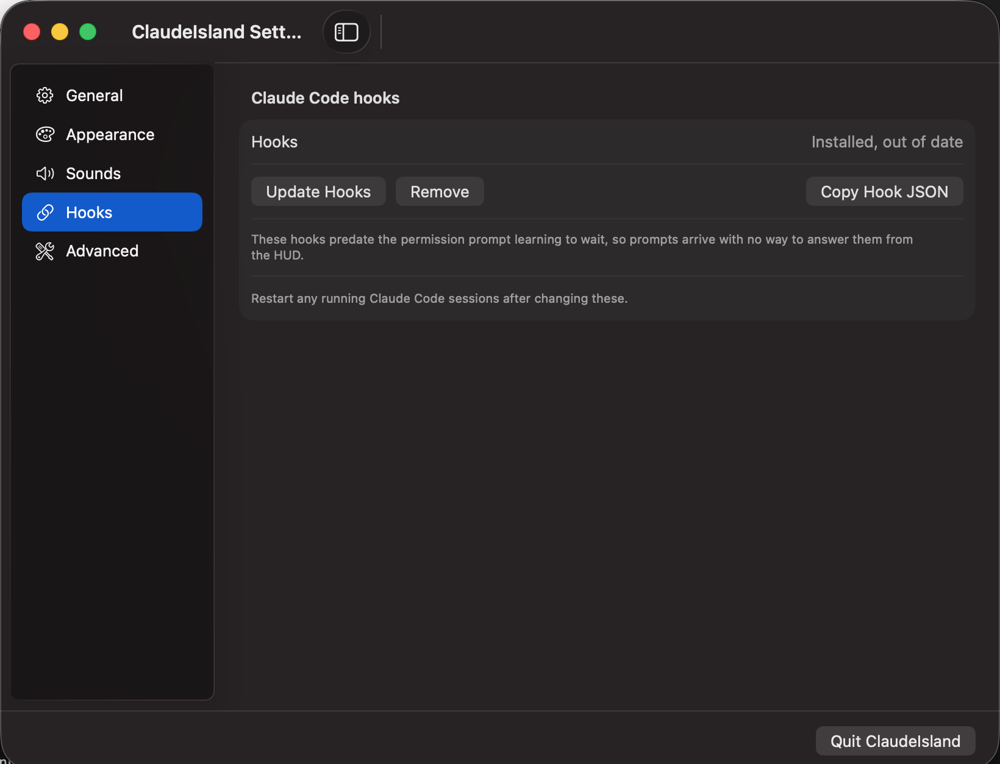

### 4. Turn on Launch at login

Under General, so the HUD survives a reboot. That pane also carries a live view
of the event pipeline — whether the socket is listening, how long ago the last
hook event arrived, how many sessions are tracked — which is the first place to
look if the island never appears at all.

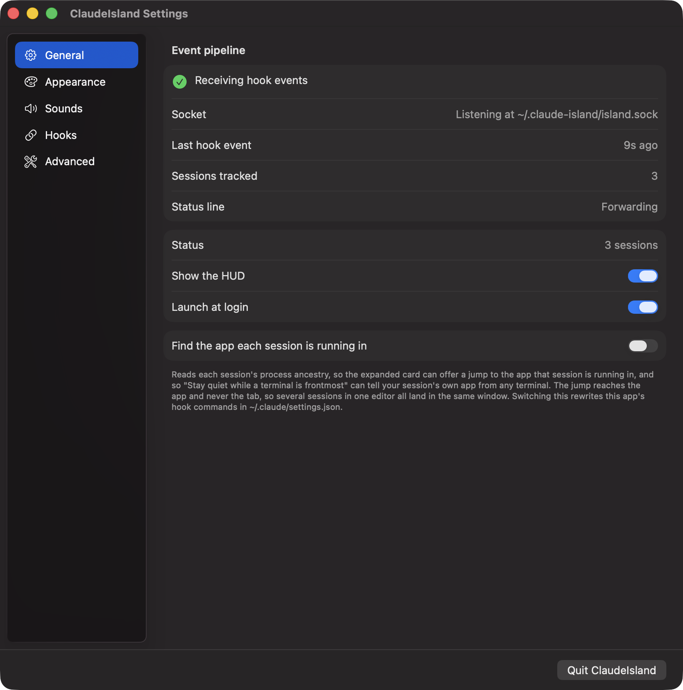

### Why it builds from source rather than shipping a binary

This project has no Developer ID to sign with, so a downloaded `.app` would
arrive quarantined and macOS would tell you it could not be verified. Code
compiled on your own machine never is. Building also means you get a binary for
your own architecture with no universal-binary machinery.

Everything is local — the app makes no network calls, ever.

## Settings

There is no menu bar icon and no Dock icon. To open Settings, launch the app
again, as above. On a fresh install the window opens by itself, since otherwise
nothing on screen would say the app had started.

The window is a sidebar with one pane per concern:

```
General     Event pipeline · Status · Show the HUD · Launch at login
Appearance  A live preview of the island, posed at each tier
            · Show it on … · Open on hover after …
Sounds      Play sounds · Stay quiet while a terminal is frontmost · a sound per
            cue, or None to skip that one
Hooks       Install / update / remove, Copy Hook JSON
Advanced    Debug log · Pin the HUD to · Reveal Support Folder
```

**Appearance** poses the real island — the same shape, content views and view
model the HUD draws with — over invented sessions, at whichever tier you press.
The two settings under it are the ones the preview is a picture of: it resolves
the shape against the display chosen there, so a notched panel previews a notch
and anything else previews the pill, and the Peek tier is what the hover delay
stands between the pointer and.

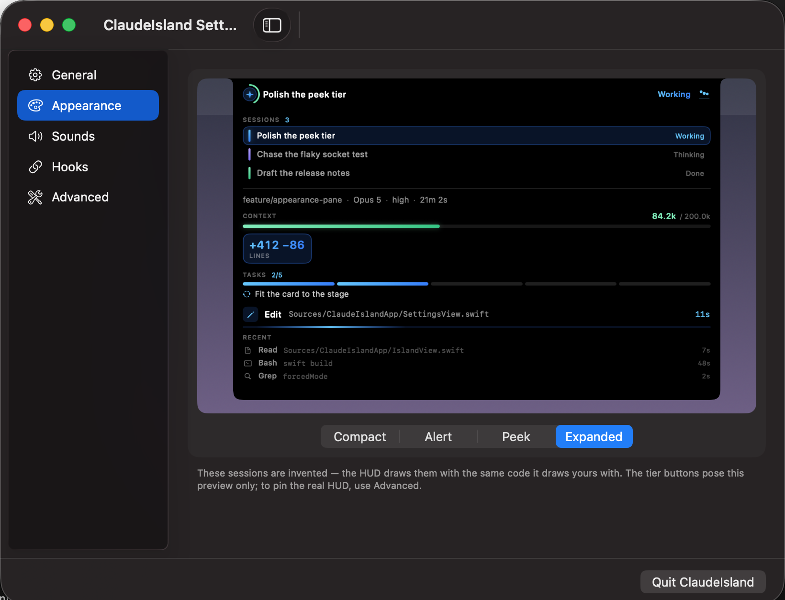

**Show it on** picks the display. The default follows the menu bar, which on a
notched Mac is where the cutout is; any other display gets the pill instead —
floating a hairline below the top edge and rounding its top corners, because
there is no bezel there to flare into:

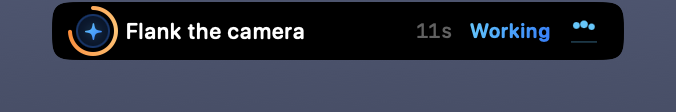

The choice is stored by display name and kept even while that display is
unplugged — the HUD falls back to the menu bar's display for as long as it is
gone and moves back on its own when it returns. Two identical monitors report
identical names and cannot be told apart.

**Open on hover after** is how long the pointer has to rest on the island
before peek opens — 0 to 500ms, 150ms by default. Without it, a pointer
crossing the top of the screen on its way to the menu bar pops the card open in
passing. Only opening waits: moving away closes it at once, because a card that
lingered over the window you have just moved to would be in the way with no way
to dismiss it. Set it to Instant for what earlier builds did.

**Quit ClaudeIsland** sits in the footer, always visible. With no menu bar icon
it is the only way to quit short of Activity Monitor, so it must never be
something you have to scroll to find. ⌘Q works too, while the window has focus.

The HUD itself is not an entry point: it is unclickable whenever no session is
running, which is most of the time.

## Something's wrong

Nothing here phones home, so a bug report has to carry its own evidence.

Start with the two things that explain most of it: **Hooks** in Settings should
read installed, and a Claude Code session started before the hooks were wired up
keeps running without them until it restarts. A HUD that never appears at all is
usually one of those.

Past that, run the self-test — with the screen unlocked, for the reason given
under [Verification](#verification):

```bash
/Applications/ClaudeIsland.app/Contents/MacOS/ClaudeIsland --selftest
```

It covers focus, click-through, geometry and settings round-tripping, and names
the culprit where it can, including [another notch app sitting above
ours](#known-conflict-other-notch-huds).

Then turn on **Write a debug log** under Advanced, reproduce the problem, and
attach `~/.claude-island/log` — **Reveal Support Folder**, at the foot of the
same pane, opens the directory holding it. That log is where dropped hook
payloads, sessions that parked in the wrong tier, and displays that went missing
leave a trace. It records project directory names but never conversation
content, and is capped at 1 MiB with a single rotation.

## Uninstall

There's no receipt system, so remove things in this order — reversing it (drag
to the Trash first) leaves every hook command in `~/.claude/settings.json`
pointing at a binary that no longer exists, so every subsequent Claude Code
hook event runs a missing command:

```bash
/Applications/ClaudeIsland.app/Contents/MacOS/ClaudeIsland --uninstall-hooks
```

or **Remove** under Claude Code hooks in Settings — either strips
ClaudeIsland's entries from `settings.json` and the forwarding line from your
status-line script, if one was added, rather than touching anything else in
those files. Then turn off **Launch at login** in the same window, and only then
delete `ClaudeIsland.app` (from `/Applications` or `~/Applications`, wherever it
landed). Its settings stay in `~/.claude-island/`; delete that folder too for a
clean sweep.

## Build

```bash
swift build -c release          # binaries
./Scripts/bundle.sh             # -> dist/ClaudeIsland.app (ad-hoc signed)
open dist/ClaudeIsland.app
```

Then install the hooks, from the settings window or the CLI:

```bash
dist/ClaudeIsland.app/Contents/MacOS/ClaudeIsland --install-hooks
```

This **merges** into `~/.claude/settings.json`, writes a timestamped backup
first, preserves hook entries belonging to other tools, and is idempotent.
`--print-hooks` prints the block to paste by hand instead. Restart any running
Claude Code sessions afterwards.

It also adds one line to the status-line script `settings.json` already points
at, forwarding that payload to the same socket — `context_window_size` is the
only place Claude Code states the exact window, and a transcript never carries
the `[1m]` suffix that would imply it. Claude Code allows a single status-line
command, so this threads into yours rather than replacing it: backup first,
only where it can see stdin being captured, and it declines with the line to
paste when it cannot. Skipping it costs only exactness — the window falls back
to being inferred from `~/.claude.json` and from usage that has already passed
a tier.

## Architecture

Three pieces.

**`claude-island-notify`** — the hook client. Claude Code invokes it on every
hook; it reads the payload from stdin and writes it to a Unix socket at
`~/.claude-island/island.sock` with a 4-byte little-endian length prefix.

Hooks block Claude Code, so this binary is fire-and-forget by construction:
non-blocking connect with a 50 ms budget, write, `_exit(0)`. Every failure path
is a silent `exit(0)` — a dead HUD must never break or slow a session. It
imports `Darwin` and nothing else, not even Foundation, because Foundation
alone adds milliseconds of dyld work per invocation.

*Measured, release build, no listener: 2.49 ms median, 4.67 ms p95.*

**`ClaudeIslandCore`** — everything below the UI, with no AppKit dependency at
all. That is what lets the whole pipeline run headlessly.

- `SocketServer` — unlinks any stale socket, binds, `chmod 0600`, one
  connection per hook, decodes to an async stream. Connection handling is
  capped at 8 in flight so a burst across several worktrees cannot spawn a
  thread per connection.
- `SessionReducer` — a pure function from `(envelope, session)` to
  `(session, timed follow-ups)`. The entire transition table is testable with
  no async and no clock.
- `SessionStore` — an actor keyed by `session_id`, publishing snapshots.
- `TranscriptWatcher` — FSEvents (never polling) on each tracked transcript's
  directory; seeks to a stored byte offset and reads only what was appended.
- `TaskProgress` — replays the session's plan from the transcript. `TodoWrite`
  writes snapshots, `TaskCreate`/`TaskUpdate` write deltas; both fold into one
  list so the HUD does not care which a session uses.

**The HUD** — an `NSPanel`, not a `Window`. Borderless, `.nonactivatingPanel`,
`level = .statusBar + 1`, refusing both key and main. The panel stays at
expanded size permanently with a transparent background; the island shape is
drawn inside it, so the morph never resizes a window.

The silhouette is `IslandShape`: flush with the top of the screen, rounded along
the bottom, and *concave* where it meets the top edge. Those inverted corners
are what make it seamless — the shape flares out of the bezel instead of sitting
on it as a rectangle, so in pure black the camera housing disappears into the
fill rather than sitting in a visible gap. `IslandOutline` is the same path left
open at the top, so stroking it never draws a line across the screen edge.

Every corner is a superellipse quadrant, not a circular arc, at one radius —
`IslandCorner.radius`, 12pt — for every tier. Both details are the cutout's:
curvature that ramps up from zero at the join reads as machined where an arc
reads as drawn, and a shape that rounds off further as it grows reads as a panel
doing a reveal rather than a hole opening. On a display with no cutout there is
no bezel to flare into, so the fallback pill rounds its top corners instead.

## Things worth knowing

**Two hook events beyond the obvious nine.** `PermissionRequest` gives the
exact tool and input for a permission prompt instead of pattern-matching
notification prose, and `PostToolUseFailure` is the only clean signal for the
error state. `Notification` is still handled as a fallback, conservatively:
text it does not recognise leaves the state alone rather than guessing.

**`thinking` is inferred, not observed.** Claude Code has no "assistant started
responding" hook. It is entered on `PostToolUse` and when the `prompting` flash
expires.

**A permission prompt can be answered from the card.** `PermissionRequest` is a
*decision* hook, not just a notification, so the client for that one event runs
with `--await-decision`: it holds its socket open and forwards whatever the HUD
answers to stdout, where Claude Code reads it.

A waiting prompt takes the island over at rest, edged in pulsing amber:

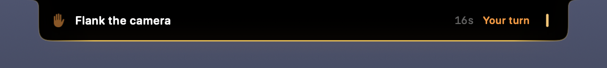

Allow and Deny appear on the peek and expanded cards, beside the command in
full. The transcript records `Allowed by PermissionRequest hook`.

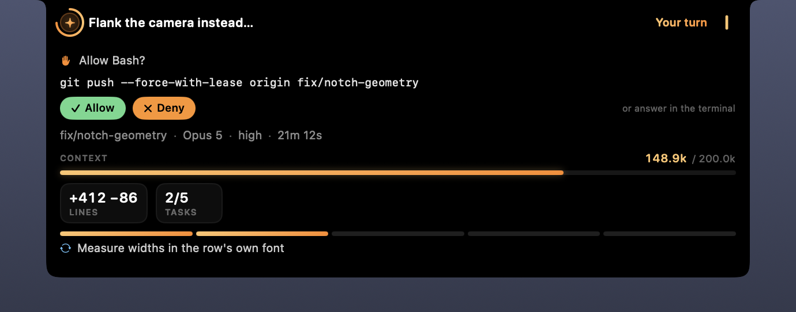

This races the terminal rather than replacing it. Claude Code paints its own
dialog *and* waits on the hook at the same time, so whichever is answered first
wins and nothing is ever taken away from the terminal — which is what the note
beside the buttons is for. Every failure path degrades the same way: a dead HUD
fails to connect in 50 ms, a wedged one is bounded by the client's deadline, and
a hook that answers nothing simply leaves the dialog where it was. That is the
whole safety argument: the worst outcome is that you walk back to the terminal,
which is where you started.

Three things it deliberately refuses to do:

- **Approve a command it cannot show you whole.** The card grows to fit the
  command; past six lines it stops growing and withholds Allow, because
  approving something with an ellipsis through the middle of it is the one
  hazard the terminal does not have.
- **Answer when two prompts are live in one session.** Parallel tool calls raise
  a prompt each while the terminal shows one at a time, and there is no signal
  pairing them up — so a press could approve the call you are not reading. The
  card says `2 prompts waiting` and refuses both.
- **Persist a rule.** `decision.applyRule` would write an "always allow" into
  settings.json, and that shape has not been verified the way allow and deny
  have been.

Answering in the terminal does **not** reap the waiting hook (measured: still
alive 10s later), so there is no signal that a prompt was settled elsewhere. The
card can briefly offer an answer Claude Code has already superseded and will
discard; the session's next event retires it, and pressing it is a no-op that
clears the offer.

Hooks installed before this existed are installed *and* stale — present, so they
look fine, but unable to answer anything. Settings says `Installed, out of date`
rather than leaving you to notice a missing button.

**A permission clears on any subsequent event.** Approve leads to `PostToolUse`,
deny leads to `UserPromptSubmit`; rather than enumerate every resolution path,
anything else happening counts as resolution.

**Alerts outrank recency.** A session awaiting permission stays on screen even
if another worktree is more recently active — otherwise the prompt vanishes
exactly when you need it.

**Subagents share the parent's `session_id`.** A running `Task` interleaves its
own `Bash`/`Read` events into the parent's stream. Rather than filter them out,
depth is tracked as a stack and the HUD shows the inner tool with a subagent
badge, because what the subagent is *doing* is the useful part.

**Token counts are split, not summed.** Claude Code writes one JSONL line per
content block and repeats the same `usage` object on each: a real transcript
here had 55 assistant lines across 26 distinct `requestId`s, so naive summing
overcounts output tokens by roughly 2×. The parser dedupes by `requestId`.
Separately, summing `input_tokens` is close to meaningless when it reads 2
against a 50,211 cache read, so the card shows live **context** occupancy (last
message's input + cache read + cache creation), cumulative **output**, and cache
reads as a **hit ratio** rather than a millions-scale raw sum. Subagent
(`isSidechain`) messages count toward spend but not toward context, since they
run in their own window.

**Branch, effort and plan progress come from the transcript, not hooks.** Hook
payloads carry none of them; transcript lines carry `gitBranch` and `effort`,
and tool calls carry the plan. One trap: `tool_use` blocks arrive on assistant
lines that *share a requestId* with the response's text and thinking blocks, so
the usage dedupe has to be applied to token counting only — folding task parsing
into it silently drops any plan update that was not the first line of a
response.

**Redaction happens at the store boundary**, not in a view, so the redacted
string is the only string the UI can ever hold. Truncation to 60 characters
happens *after* redaction — truncating first could cut a secret in half and
leave the leading half on screen.

## The notch is a hole, not a region

The single most expensive lesson here. Content drawn inside the notch band is
not clipped by software — those pixels do not exist. A pill centred on the
cutout put its text inside the hole, and it vanished at exactly
`auxiliaryTopLeftArea.maxX` (790 on this display), reappearing past
`auxiliaryTopRightArea.minX` (1010). It looked exactly like a truncation bug and
survived two wrong fixes before the cut was measured and landed on 790.5.

The resting island therefore **flanks the camera**: a row that sits inside the
menu bar band with its content either side of the cutout and nothing in it. Peek
and expanded keep that same row as their header and put additional rows below
the band, where the full width is available.

Three consequences worth knowing, each of which produced a bug first:

- **The flanks are sized independently and the shape is not centred on the
  camera.** It extends exactly as far as each side's content needs. Forcing
  symmetry makes the shorter side carry dead space equal to the difference.
- **Widths are measured with the font the row actually renders in**
  (`TextMetrics`). Measuring a monospaced target with the rounded font, or at
  `.regular` when it renders at `.medium`, under-measures by about a character
  and the label truncates inside a frame that looked wide enough.
- **The panel has to be wider than the widest island.** The shape is clipped to
  its window, so an undersized panel silently caps the island and reads as yet
  another truncation bug.
- **Padding belongs inside the flanking frames, applied exactly once.** Padding
  a flank from outside adds to a row already sized to the shape; an outer inset
  on the content narrows the row and drags its camera gap off the real cutout.
  Both present as a truncated label, which is the same symptom as the three
  causes above — five different bugs with one appearance.

## Two implementation notes that cost real work

**Click-through cannot use an `NSTrackingArea`.** The obvious design — toggle
`ignoresMouseEvents` from a tracking area — is circular: once the panel ignores
mouse events it receives none, so the tracking area can never fire
`mouseEntered` to switch it back. A global `NSEvent` monitor runs outside the
panel and sees the cursor regardless. Mouse-only global monitors need no
Accessibility permission (keyboard ones do). The monitor is installed only
while a session is active.

**Repeating animations run in Core Animation, not SwiftUI.** A
`withAnimation(....repeatForever())` re-runs the entire view graph every frame.
Profiling showed `CA::Transaction::flush` → `NSHostingView.layout()` → full
`ViewGraph` render at the display's 120 Hz, costing **4.5% CPU** for one pulsing
glyph — against a 0.1% idle budget. The same pulse as a `CABasicAnimation` is
handed to the render server once and costs the app process nothing per frame:
**0.33%**. The shape morph is still a SwiftUI spring; only the two perpetual
animations moved.

## Measured behaviour

| | |
|---|---|
| Idle CPU, no sessions | **0.000%** over 40 s |
| Compact, animating | 0.2% |
| Alert, pulsing | 0.33% |
| Hook client, no listener | 2.49 ms median / 4.67 ms p95 |
| Tests | 257 passing |
| Self-test | 143 checks |

## Visual language

Every state owns a two-stop accent rather than a flat colour, so a glyph, a ring
and a bar all tint from one source and read as lit rather than filled — blue for
working, indigo for thinking, amber for your turn, mint for done, rose for
failed, violet for compacting. The island's own fill stays essentially black: it
has to keep passing for the camera housing, so the gradient on it is a few points
of lift at the top and nothing more.

Two things are drawn rather than written, because a figure alone does not carry
them:

- **Context occupancy** is an arc around the session glyph and a meter in the
  cards, coloured mint → amber → rose as the window fills. The limit is
  *inferred*, never asserted: the model id sometimes carries `[1m]`, but a
  transcript can record the plain id for a session running the larger window, so
  an observed count above a tier is taken as proof of the next one up. Reading
  "603.2k / 200.0k" is worse than having no bar at all. Only the bar is inferred
  — the token counts themselves are exact.
- **Plan progress** is a row of segments, countable at a glance in a way `3/7`
  is not.

Session rows in the switcher carry a state-coloured rail so the list can be
scanned by colour before it is read, and the row that needs you is washed and
outlined in amber.

## Interaction

Three levels of detail, each earning its own layout.

**Compact** — a single line, always. Session glyph, session name, then the
status word and mark on the right. It names the session and nothing else: which
tool is running churns with every call and says less than the status word
already does, so that detail lives in the peek.

Every tracked session rests as one line, including `Done` and `Waiting`. Those
two used to collapse to dormant, which hid exactly the states you are most
likely to be waiting on. Only a HUD with no sessions at all goes dark.

Every state owns its own mark, and every mark is an animation: a brightness wave
travelling through three dots for `Thinking`, three balls bouncing on a ground
line for `Working`, three dots flying in for `Sent`, two bars closing on each
other for `Compacting`, a blinking caret for `Waiting` and `Your turn`, a check
for `Done`, a cross for `Failed`. All of them run in Core Animation rather than
SwiftUI, for the reason above.

The name is cut on a word at 18 characters and carries no ellipsis — the pill is
a label, not a claim to be complete, and the whole title is one hover away.

**Peek** (hover, after the dwell set on Appearance) — adds the live tool target,
the identity line (branch, model, effort, elapsed), context and output tokens,
lines changed, and plan progress with the task currently in flight.

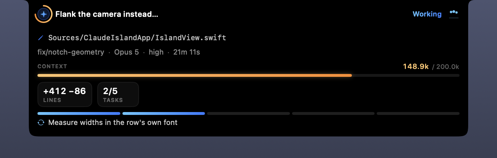

**Expanded** (click) — a switcher. Every active session is listed and
clickable, each with a state-coloured rail; selecting one shows its detail
below, ending in the trail of recent tool calls. Click the island again, or
anywhere outside, to dismiss.

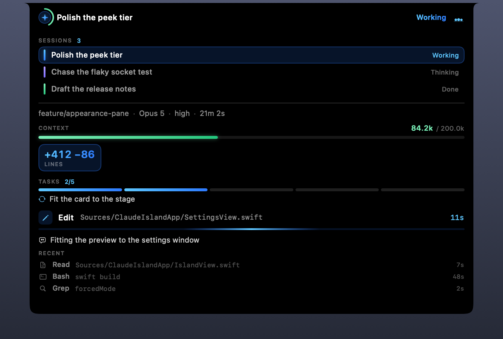

The card is sized across **all** sessions, not the selected one, so browsing
never resizes it. Sized from the selection, its width followed that session's
name length and its height followed that session's tool count and task block, so
every click reflowed the whole HUD. Two self-test checks guard it.

A permission request always takes over the view, even from an explicit
selection — missing a prompt is worse than losing your place. The selection is
kept rather than discarded, the takeover is labelled, and the view returns to
your session once the prompt is answered.

When no session is active the island is dormant and deliberately unreachable —
the mouse monitor is torn down entirely, which is what keeps idle CPU at
0.000% rather than merely low. Open the app again to reach Settings in that
state.

## Verification

```bash
swift build && swift run ClaudeIslandTests      # 257 tests
./dist/.../ClaudeIsland --replay Fixtures/basic-session.jsonl
./dist/.../ClaudeIsland --selftest              # focus + click-through
./dist/.../ClaudeIsland --probe-screens         # notch geometry per display
./dist/.../ClaudeIsland --probe-screens "DELL P3223QE"   # …and where that choice lands
```

Passing a display name to `--probe-screens` tries that choice without saving it.
Name one that is not plugged in to watch the fallback happen from a terminal
rather than by pulling a cable.

`--replay` feeds a recorded JSONL log through the full pipeline with no UI, on a
virtual clock so timed transitions fire deterministically and traces are
byte-stable. Fixtures in `Fixtures/` cover a normal session, permissions and
failures, two concurrent sessions, subagents, and deliberately hostile input
(malformed lines, unknown future events, embedded secrets).

`--selftest` is a 143-check harness for what unit tests cannot exercise: that
the panel never takes focus, that clicks land where they should, that a settings
change reaches both disk and the running HUD, and dozens of on-screen layout and
geometry checks besides. Click-through is verified
against the window server itself via `NSWindow.windowNumber(at:)` rather than
trusting our own flags. **Run it with the screen unlocked** — a lock
screen puts a full-screen `loginwindow` layer above everything and those three
checks are reported as skipped rather than silently passing. Run through
`swift run` rather than from the bundle, the launch-at-login check skips for the
same reason: there is nothing there to register.

Neither reaches the permission contract, which turns on Claude Code's behaviour
rather than on this code — and `PermissionRequest` fires only on the interactive
path, so a headless `claude -p` run cannot exercise it at all. `Scripts/verify/`
holds the harnesses that can: a pty driving a real session, a synthetic suite
over the real socket, and an accessibility walker that presses the card's
buttons by title rather than by coordinate. Re-run them when Claude Code
updates — a broken contract shows up as a button that quietly stopped working,
and nothing else here would catch it. That folder's own README says what each
one proves.

### Known conflict: other notch HUDs

The panel sits at `.statusBar + 1` (level 26). Some notch apps use far higher
levels — "Claude Usage" on this machine holds the notch at level **1000** — and
will render above ClaudeIsland and win the hit test over the island shape. This
is by design rather than a defect: the level is deliberately conservative so the
HUD never floats above things it shouldn't.

`--selftest` detects this and names the offending app instead of reporting a
failure. Quit the other app to evaluate that check, or raise the level in
`IslandPanel.init` if you would rather ClaudeIsland win.

### Note on the test harness

Tests run via `swift run ClaudeIslandTests`, not `swift test`. Apple's Command
Line Tools ship swift-testing's module and macro plugin but not
`lib_TestingInterop.dylib`, so an `.xctest` bundle compiles and then fails to
`dlopen`; XCTest is Xcode-only. Since the project takes no third-party
dependencies, `Tests/ClaudeIslandCoreTests/TinyTest.swift` is a ~120-line
harness whose call shapes (`expect`, `require`, `fail`) mirror swift-testing, so
the suites port back with a mechanical find-and-replace if Xcode is installed.

## Debug tint

Pure `#000` is deliberate — it makes the island read as the physical cutout —
but it also makes the shape's edges invisible while iterating on layout.
`debugTint` fills it indigo with a cyan edge so the outline, the corner radii
and the notch punch-out are all visible:

```bash
touch ~/.claude-island/tint       # folded into settings.json at next launch
```

There is deliberately no toggle for it in Settings. It is an authoring aid, not
a preference: switched on by accident it just makes the HUD look broken, and it
produces nothing you could attach to a bug report that a plain screenshot would
not. The file covers the one case where somebody else needs it — showing where
the island actually landed on a display where it landed wrong.

**Pin the HUD to** under Advanced holds the HUD at one tier; that exists because
hover and click cannot be synthesised without Accessibility permission — without
it the open tiers cannot be looked at at all, and three padding bugs in the peek
layout survived precisely because they had never been seen. Leave it off
otherwise: a leftover pin fails most of `--selftest`'s mode checks.

## Configuration

Settings live in `~/.claude-island/settings.json` — one readable file, safe to
hand-edit or delete (deleting it restores every default). Changes made in the
window apply immediately; changes made in the file are picked up at next launch.
`preferredDisplay` and `forcedMode` are absent until set — the encoder omits
them rather than writing null.

```json
{
  "debugTint": false,
  "doNotDisturb": false,
  "doneSound": { "enabled": true, "name": "Glass" },
  "hoverOpenDelayMilliseconds": 150,
  "hudEnabled": true,
  "inputRequiredSound": { "enabled": true, "name": "Ping" },
  "logging": false,
  "muteWhileTerminalFrontmost": false,
  "waitingSound": { "enabled": true, "name": "Pop" }
}
```

A cue set to **None** in the window is `"enabled": false` here, with `name` left
holding the sound it goes back to — picking None silences that one cue without
costing you the sound you had.

Logging is **off by default**. Turn it on under Advanced, or:

```bash
touch ~/.claude-island/debug      # folded into settings.json at next launch
CLAUDE_ISLAND_DEBUG=1             # or override for one run, writing nothing
```

`dnd`, `tint` and `force-mode` work the same way — each is consumed on the next
launch and folded into the JSON, which is also how installs from before the
settings window carry their old flags across.

It writes to `~/.claude-island/log`, capped at 1 MiB with a single rotation.

No network calls are made, ever. All data is local.

## Sandboxing

Ships unsandboxed. The socket lives in `~/.claude-island/` and transcripts are
read from `~/.claude/projects/`, both outside any container. To sandbox it:

1. Move the socket into the container (`~/Library/Containers/<id>/Data/`) and
   teach the hook client to find it there — it currently hardcodes
   `$HOME/.claude-island/island.sock`, and `$HOME` differs inside a sandbox.
2. Obtain read access to `~/.claude/projects/` and `~/.claude/sessions/`, which
   means a user-selected security-scoped bookmark; there is no entitlement that
   grants another app's support directory.
3. Writing hooks into `~/.claude/settings.json` needs the same bookmark, or the
   installer becomes copy-and-paste only.
4. Add `com.apple.security.app-sandbox` plus `files.user-selected.read-write`,
   and sign with a real Developer ID rather than ad-hoc.

Step 2 is the awkward one: a sandboxed build would have to prompt for access to
`~/.claude` on first run and persist the bookmark.

## Layout

```
Sources/ClaudeIslandCore/     types, state machine, store, watcher, redaction, IPC
Sources/ClaudeIslandApp/      panel, views, settings window, CLI entry points
Sources/claude-island-notify/ hook client (Darwin only)
Tests/ClaudeIslandCoreTests/  suites + TinyTest harness
Fixtures/                     replay logs
Scripts/install.sh            the one-file installer: clone, build, wire hooks
Scripts/bundle.sh             .app assembly + ad-hoc signing
Scripts/make-icon.swift       draws Resources/AppIcon.icns from the app's shapes
Scripts/verify/               harnesses for the permission contract
Resources/AppIcon.icns        committed, so an install renders no pictures
docs/images/                  the screenshots above
docs/superpowers/             design documents and plans
```

Every island shot above is the shipping views, drawn by the real panel at the
real notch geometry, posed over invented sessions under a plainly fake home — the
way the Appearance pane poses its own preview, and for the same reason: a
screenshot of a live session would put someone else's directory names in front of
you. The backdrop stands in for the desktop; the cutout is painted black because
in life those pixels sit behind the bezel.
